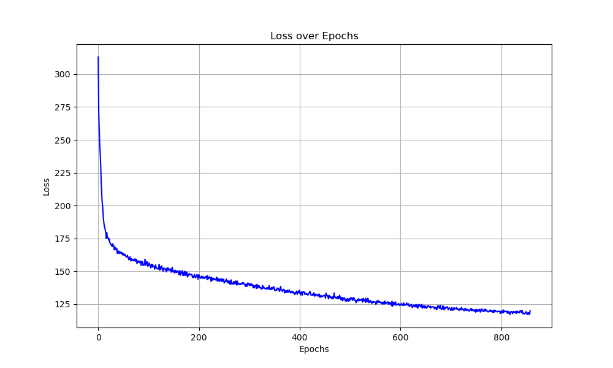
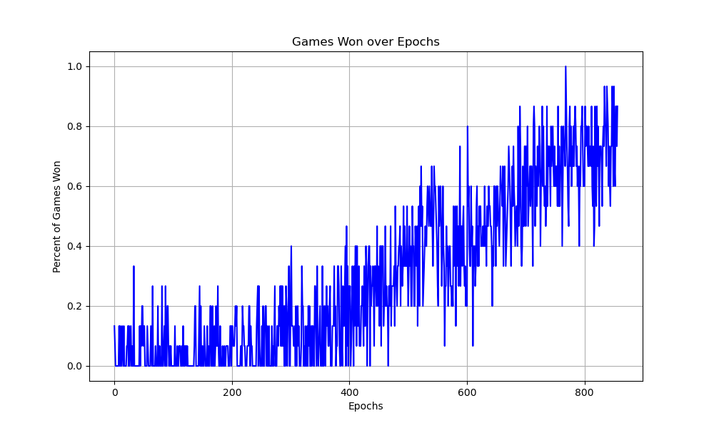

# wordRLe
This is an attempt to "solve" the game Wordle from the New York Times using a character level transformer model, and offline reinforcement learning.

## How Wordle Works
Wordle is a popular word puzzle game where the objective is to guess a hidden five letter word in six attempts or fewer. The user takes turns at guessing valid five letter words, until they either run out of guesses, or find the correct word. To help guide the player, the game provides feedback in the form of colors. Each character in a guess gets assigned a color based on the target word. Characters in the right position, that is in the same index of the target word, are green. Characters present in the target word, but in the wrong index are colored yellow, and characters that are not present in the target word remain black.

This poses an interesting problem-space for reinforcment learning, especially on the character level. The model not only be able to form valid enlish words, but it must also leverage learned rules of the game in order to complete it.

## How to Train and Play
`data/wordle.csv` contains all ~13k five letter words, their probabilistic frequency, and the day (if any) a word has been played. Some words are a lot less likely than others to be played. This game has been designed to only select the 2.1k words with probability greater than 1e-6, roughly matching the true Wordle game. 

To train the model run `train_offline.py`, which will begin the training loop.
To check the results of the model, run `play_wordle.py`, which will simulate the game of Wordle, and print the models outputs. 

## Performance
The final model is capable of solving the game around 95% of the time. This was found using beam searching, which is an algorithm that finds the cumulative highest probability output from the model, as opposed to random probabilistic sampling, or pure greedy approach.

The games won plot shows the results during training, which used a beam search size of 1, which is the greedy search.

### Thanks and Credits
Thanks to https://github.com/steve-kasica/wordle-words for the list of five letter words, and to https://github.com/karpathy/nanoGPT for the GPT model.